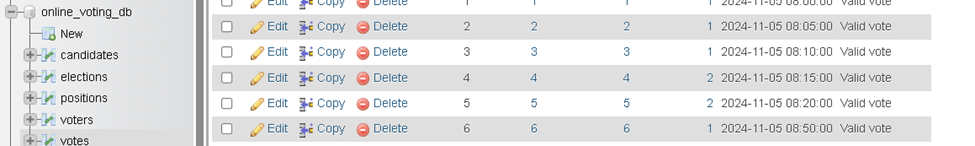
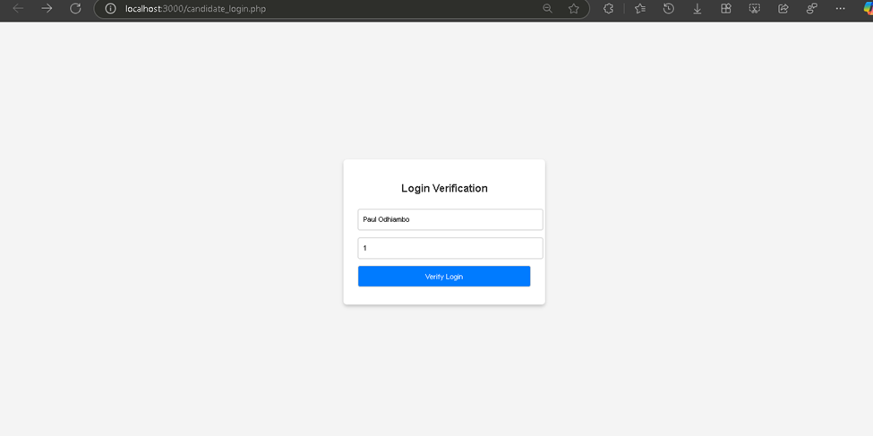
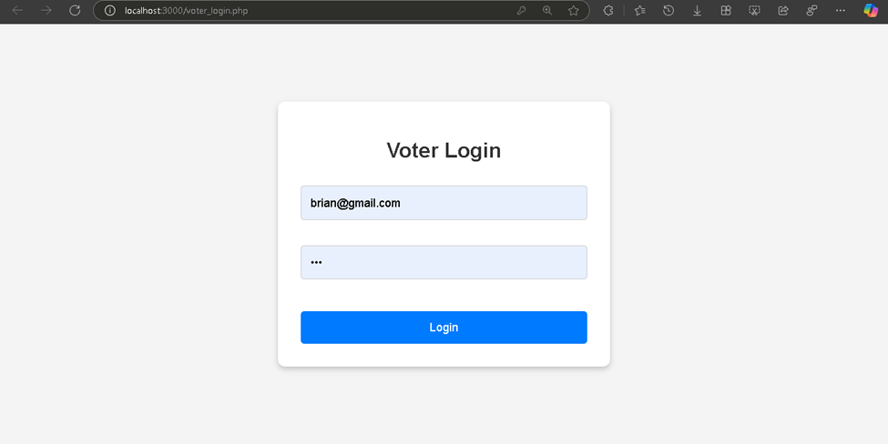
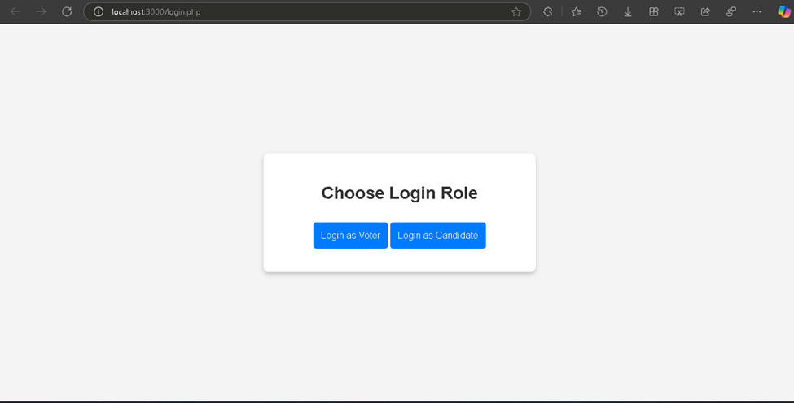
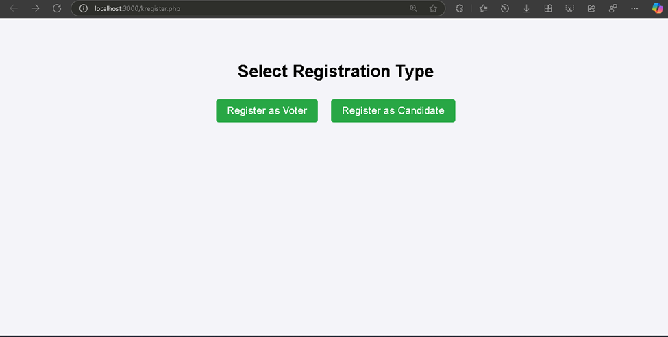
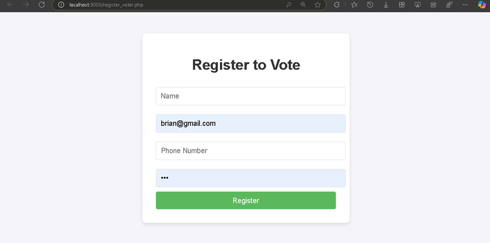
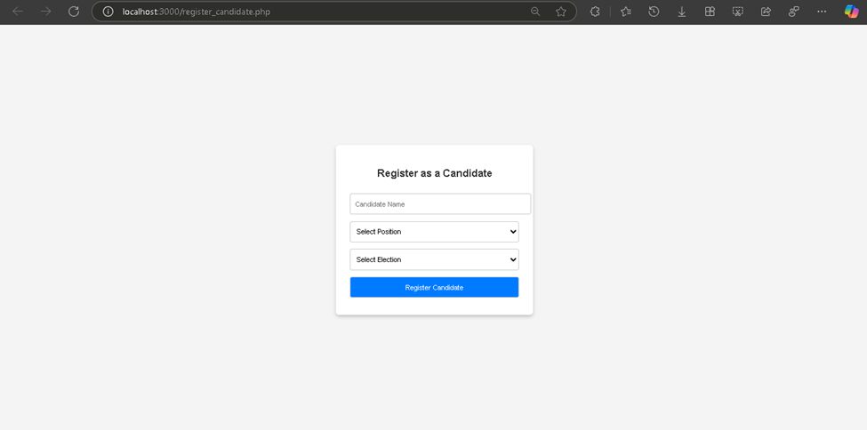
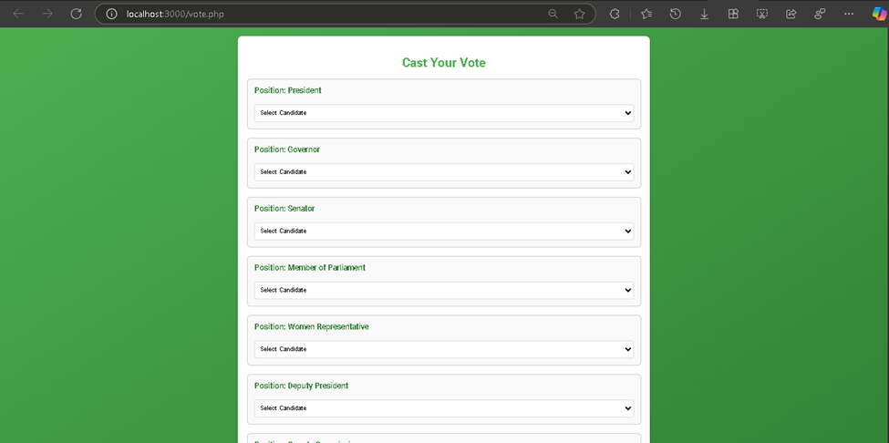
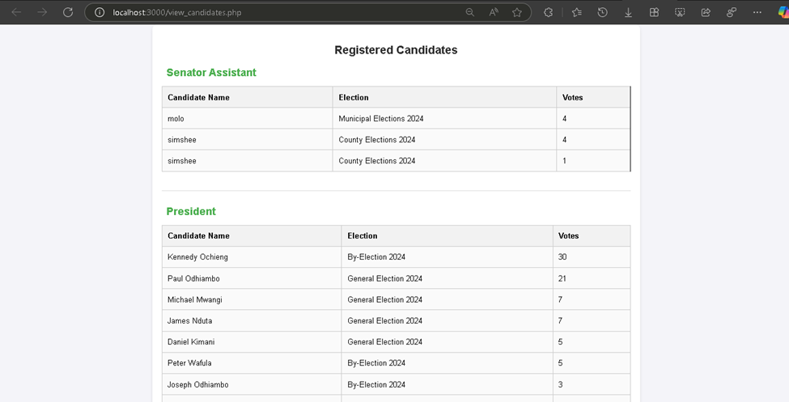
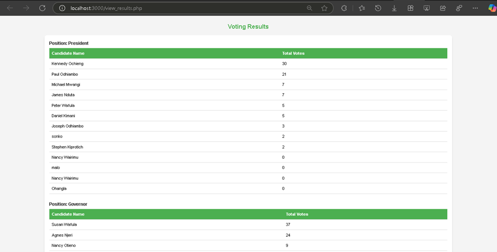

# 🗳️ Online Voting System

This project is a simple web-based Online Voting System developed using html embedded in PHP and MySQL Database. It includes voter and candidate registration, login, voting, and results viewing. The system ensures a user-friendly experience while handling different election roles and vote counts securely.

---

## 🧾 MySQL Database Structure

This system uses a MySQL database to store and manage data such as registered voters, candidates, votes, and login credentials.

>   
*Screenshot showing the structure of the database tables.*

---

## 📂 Project Files & Screenshots Overview

### `candidate_login.php`
Allows candidates to log in using their **Name and ID** for verification.
> 

---

### `voter_login.php`
Allows voters to log in using their **email and password**.
> 

---

### `login.php`
Login interface where users specify their **role** (either **Candidate** or **Voter**) before being directed to their respective login process.
> 

---

### `kregester.php`
Registration interface that lets users choose their **registration type** – either **Voter** or **Candidate**.
> 

---

### `register_voter.php`
Form for registering a new voter by collecting **Name, Email, Phone Number**, and **Password**.
> 

---

### `register_candidate.php`
Form to register a new candidate, including **Candidate Name**, **Position** (e.g., Senator, President), and **Election Type**.
> 

---

### `vote.php`
Displays available candidates and their respective positions. Voters use a **dropdown menu** to select and cast their vote for a specific candidate.
> 

---

### `view_candidates.php`
Displays a list of all candidates along with their positions, such as **President**, **Senator Assistant**, etc.
> 

---

### `view_results.php`
Displays total **votes counted per candidate** along with the **position** they contested for, providing a summary of the election results.
> 

---
